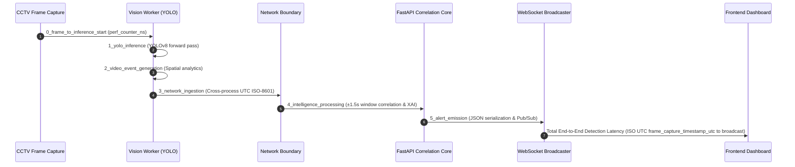
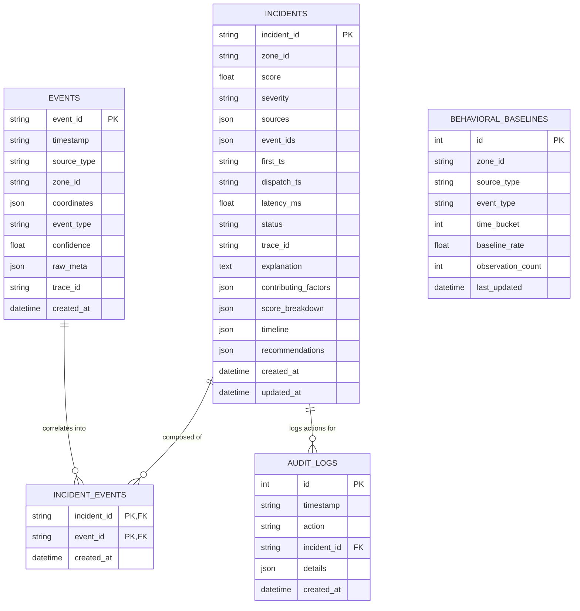

# Gryffindor Sentinel — Technical Architecture & Visual Walkthrough (Phase 3C)

## 🏛️ End-to-End System Architecture

```mermaid
flowchart TD
    subgraph MultiModalIngestion["Multi-Modal Sensors & Vision"]
        A1["CCTV Camera Stream"] -->|RTSP / OpenCV| A2["Vision Worker (YOLOv8)"]
        A2 -->|POST /ingest (UTC ts + trace_id)| B1
        S1["IoT Sensors (Door/Motion/Keycard)"] -->|POST /ingest| B1
        C1["Cyber Syslog (Auth / Login Spike)"] -->|POST /ingest| B1
    end

    subgraph FastAPIBackend["FastAPI Sentinel Core"]
        B1["Ingestion Endpoint & Validation"]
        B1 --> B2["De-duplication Check"]
        B2 --> B3["PostgreSQL Events Persistence"]
        B3 --> B4["Threat Correlation Engine (±1.5s Window)"]
        B4 --> B5["Scoring Engine & XAI Factor Extraction"]
        B5 --> B6["Incident Synthesis & De-duplication"]
    end

    subgraph StorageAndCache["Production Persistence & State"]
        B3 --> PG1[("PostgreSQL DB (Authoritative)\n- events\n- incidents\n- incident_events\n- behavioral_baselines\n- audit_logs")]
        B6 --> PG1
        B6 --> R1[("Redis Server (Real-Time State)\n- active_incidents cache\n- Pub/Sub channel\n- Degraded fallback")]
    end

    subgraph LiveAlerts["Tactical Output & Dashboard"]
        R1 --> WS1["WebSocket Manager (/ws/alerts)"]
        WS1 --> Dash["Tactical Dashboard UI"]
    end
```

---

## ⏱️ 6-Stage Latency Pipeline Architecture



---

## 🗄️ Database Entity-Relationship Model (ERD)



---

## 💻 Multi-Laptop Network Deployment Guide

For a multi-laptop hackathon setup:

1. **Laptop 1 (FastAPI Backend + PostgreSQL + Redis)**:
   - IP: `192.168.1.100`
   - Run `docker-compose up -d`
   - Run `alembic upgrade head`
   - Run `python -m uvicorn backend.main:app --host 0.0.0.0 --port 8000`

2. **Laptop 2 (Vision Worker / CCTV Camera)**:
   - Environment: `HUB_URL=http://192.168.1.100:8000`
   - Run `python ai/vision_worker.py --source 0 --zone Server_Room --hub http://192.168.1.100:8000`

3. **Laptop 3 (Dashboard / Simulators)**:
   - Set `.env`:
     ```env
     VITE_API_URL=http://192.168.1.100:8000
     VITE_WS_URL=ws://192.168.1.100:8000/ws/alerts
     ```
   - Run `npm run dev`
